## Week 1

### Data Basics

#### Variables

1. Numerical
   1. Continuous
   2. Discrete
2. Categorial
   1. Regular Categorial
   2. Ordinal

#### Relationships between variables

1. Associated (Dependent)
   1. Positive
   2. Negative
2. Independent

### Observational Studies & Experiments

#### Studies

1. Observational

   - collect data in a way that does not directly interfere with how the data arise

   - only establish an association

   1. Retrospective (use past data)
   2. Prospective (data collected throughout the study)

2. Experiment

   - Random assign subjects to treatments
   - Establish causal connections

#### Confounding variables

\- Extraneous variables that affect both the explanatory and the response variable and that make it seem like there is a relationship between them

#### ***Correlation does not imply causation***

### Census and Sampling

#### Census

#### Sampling

- Exploratory analysis
- Representative sample
- Inference

#### Sampling Bias

1. Convenience Sample
2. Non-response
3. Voluntary Response

#### Sampling Methods

1. Simple Random Sample (SRS)

   \- Each case is equally likely to be selected

2. Stratified Sample 

   \- Divide the population into homogeneous *STRATA*, then randomly sample from within each stratum

3. Cluster Sample

   \- Divide the population *CLUSTERS*, randomly sample a few clusters, then sample all observations within these clusters.

4. Multistage Sample

   \- Divide the population *CLUSTERS*, randomly sample a few clusters, then randomly sample within these clusters.

### Experiment Design Principles

1. Control

   \- Compare treatment of interest to a control group

2. Randomize

   \- Randomly assign subjects to treatments

3. Replicate

   \- Collect a sufficiently large sample, or replicate the entire study

4. Block

   \- Block for variables known or respected to affect the outcome

#### Blocking vs. Explanatory variables 限制变量vs解释变量

- Explanatory variables (factors) - conditions we can impose on experimental units
- Blocking variables - characteristics that the experimental units come with, that we would like to control for

#### Terms

**Placebo**: fake treatment, often used as the control group for medical studies

**Placebo effect**: showing change despite being on the placebo

**Blinding**: experimental units don't know which group they are in

**Double-Blind**: both the experimental units and the researchers don't know the group assignment

### Random Sample Assignment

Random Sampling: `generalizability`

Random Assignment: `causality`

Confounding Variable 混杂变量

Stratified sampling allows for controlling for possible confounders in the sampling stage, while blocking allows for controlling for such variables during random assignment.

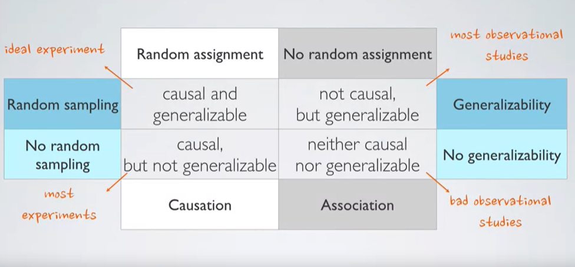

## Week 2

### Visualization of Numerical Data

#### Scatterplots

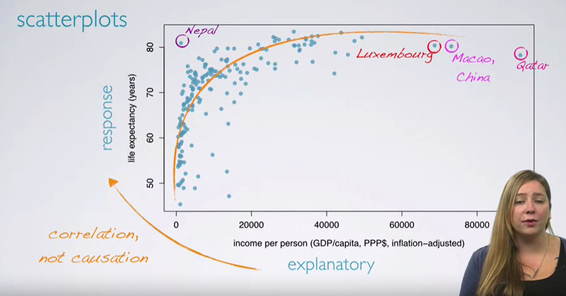

**Evaluating the relationship**

1. Direction
   1. Positive
   2. Negative
2. Shape
   1. Linear
   2. Curved
3. Strength
   1. Strong
   2. Weak
4. Outliers

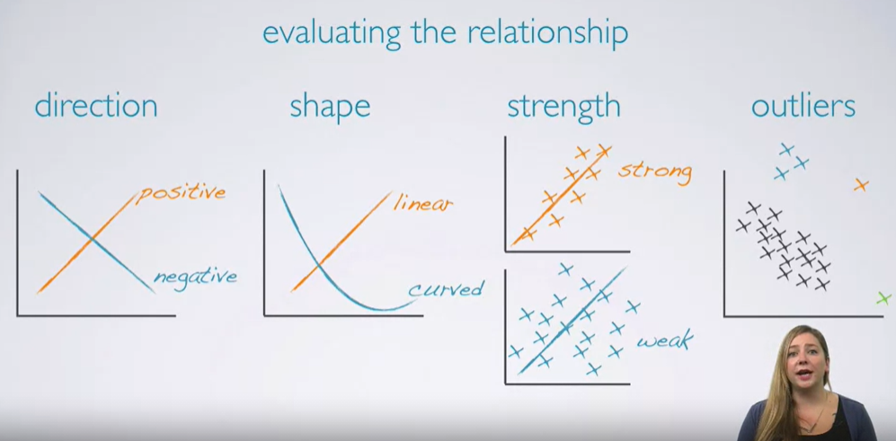

#### Histogram

- Provides a view of the **data density**
- Especially useful for describing the shape of the distribution

**Skewness**

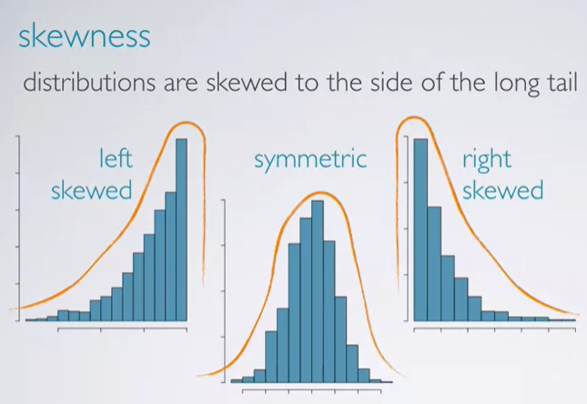

\- Distributions are skewed to the side of the long tail

**Modality**

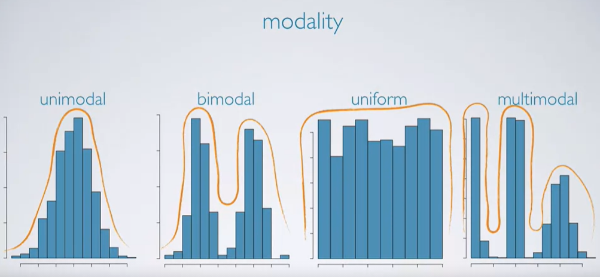

**Bin Width**

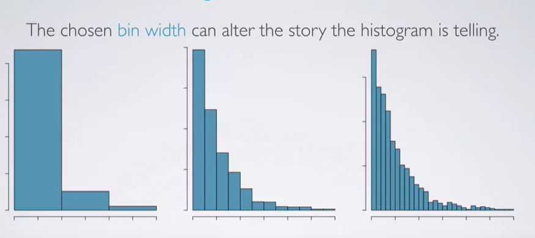

#### Dotplot

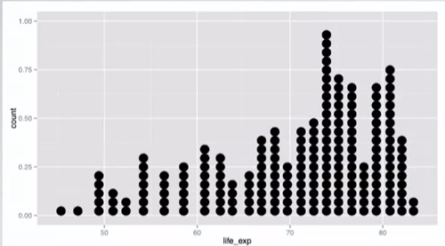

- Useful when individual values are of interest
- Can get busy as the sample size increases

#### Box Plot

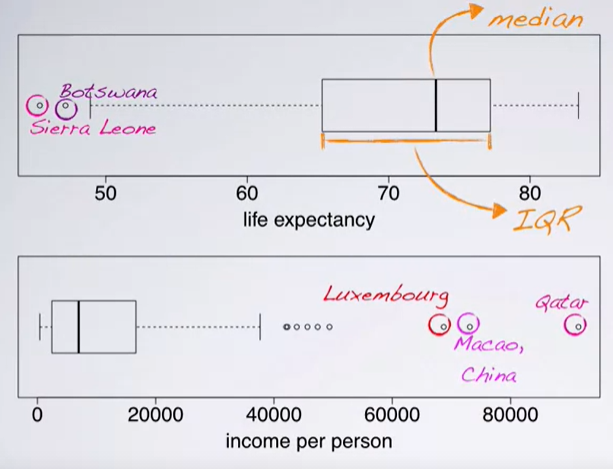

- Useful for highlighting outliers, median, IQR

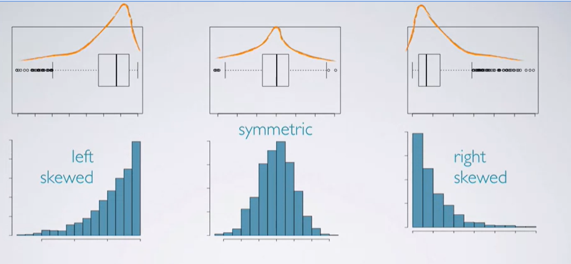

#### Intensity Map

- Useful for highlighting the spatial distribution

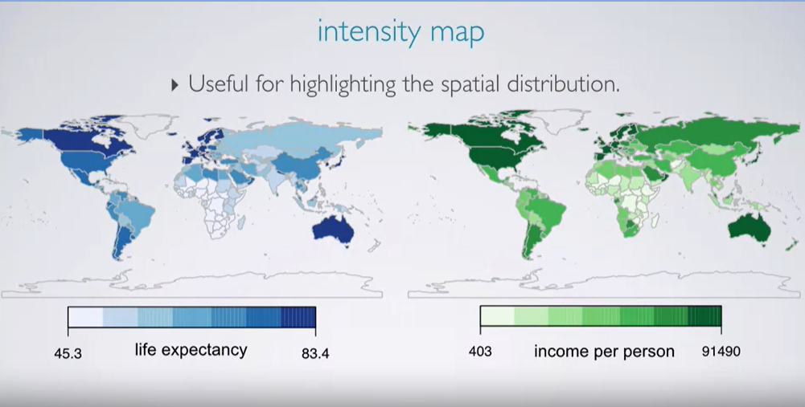

### Measures of Center

1. Mean

   \- Arithmetic average

   - x̄: sample mean
   - μ: population mean

2. Median

   \- Midpoint of the distribution (50th percentile)

3. Mode

   \- Most frequent observation

Denotation

Latin - sample statistics

Greek - population parameters

**Skewness and measures of center**

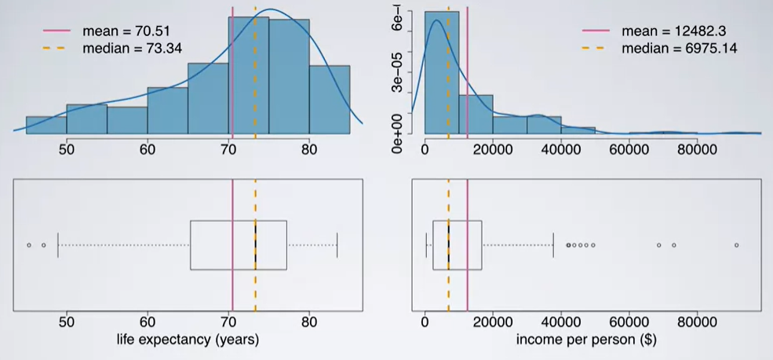

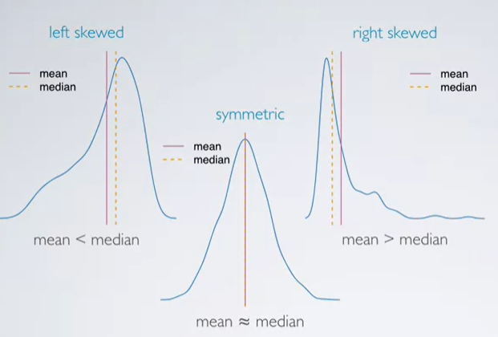

left-skewed: mean < median

right-skewed: mean > median

### Measures of spread

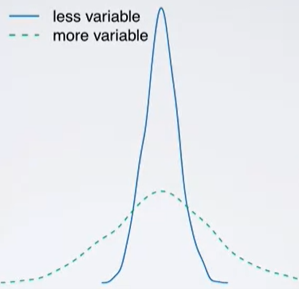

1. Range: (max-min)

   

2. Variance

   Roughly the average squared deviation from the mean

   - s² - sample variance
   - μ² - population variance

   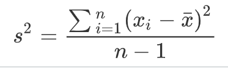

   *Why do we square the difference?*

   1. get rid of negatives so that negatives and positives don't cancel each other when added together

   2. increase larger deviations more than smaller ones so that they are weighed more heavily

   

   ***Variability ≠ Diversity***

      

3. Standard deviation

   Roughly the average deviation around the mean, and has the same unit as the data

   - s: sample SD

   - σ: population SD

   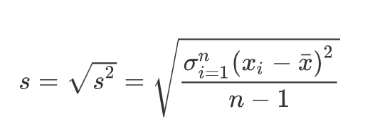

     

4. Inter-quartile range

   \- Range of the middle 50% of the data, distance between the 1st quartile (25th percentile) and 3rd quartile (75th percentile)

   

   ***IQR=Q3-Q1***

   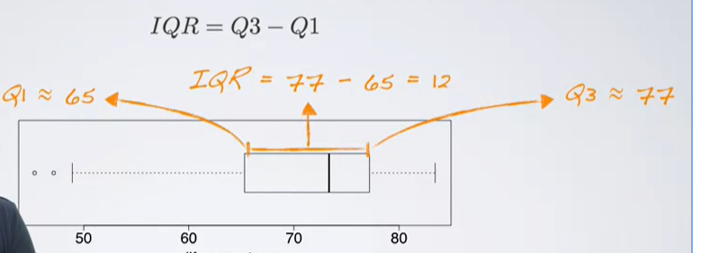

### Robust Statistics

Measures on which extreme observations have little effect.

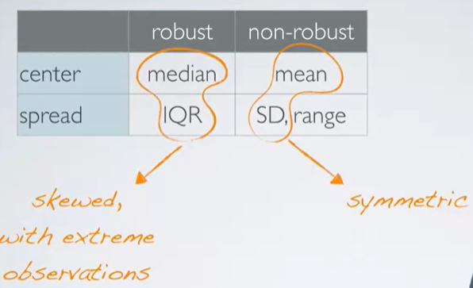

### Transforming Data

- A ***transformation*** is a rescaling of the data using a function
- When data are very strongly skewed, we sometimes transform them so they are easier to model 

**Goals of Transformations**

- to see the data structure differently
- to reduce skew assist in modeling
- to straighten a nonlinear relationship in a scatterplot

#### (Natural) Log Transformation

\- Often applied when much of the data cluster near 0 (relative to the larger values in the data set) and all observations are positive.

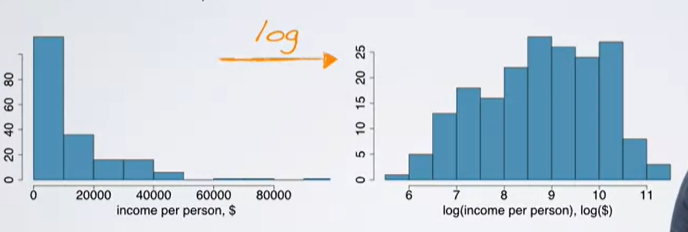

\- To make the relationship between the variables more linear and hence easier to model with simple methods.

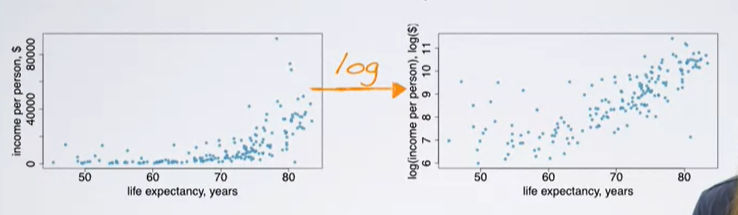

#### Other Transformations

Square root / inverse

### Categorial Variables

#### Frequency table & bar plot

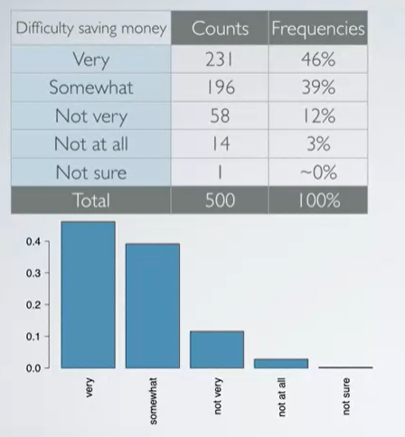

Bar plots vs. Histogram

- barplots for categorial variables, histograms for numerical variables.
- x-axis on a histogram is a number line; and the ordering of the bars are not interchangeable

#### Pie chart (x)

#### Contingency table

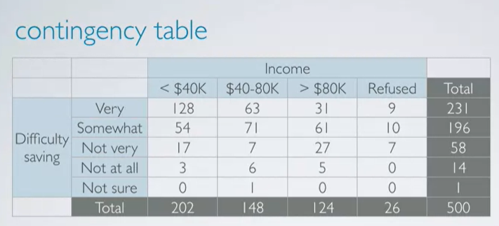

#### Segmented bar plot

- Useful for visualizing conditional frequency distributions
- Compare relative frequencies to explore the relationship between the variables

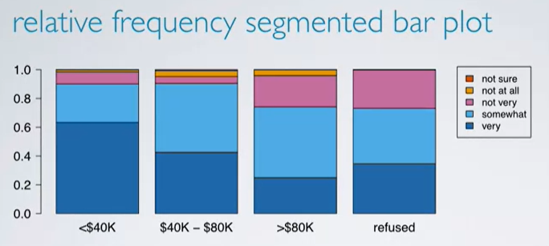

#### Mosaicplot

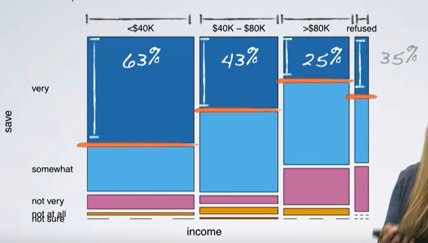

#### Side-by-side box plots

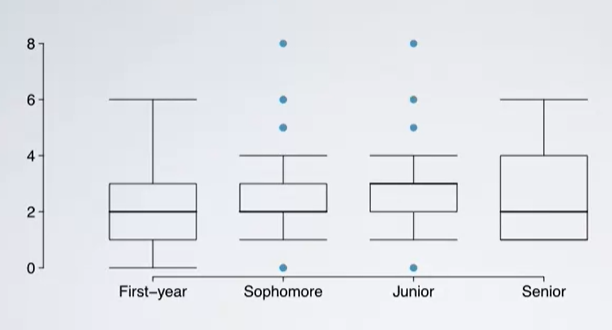

## Week 3
